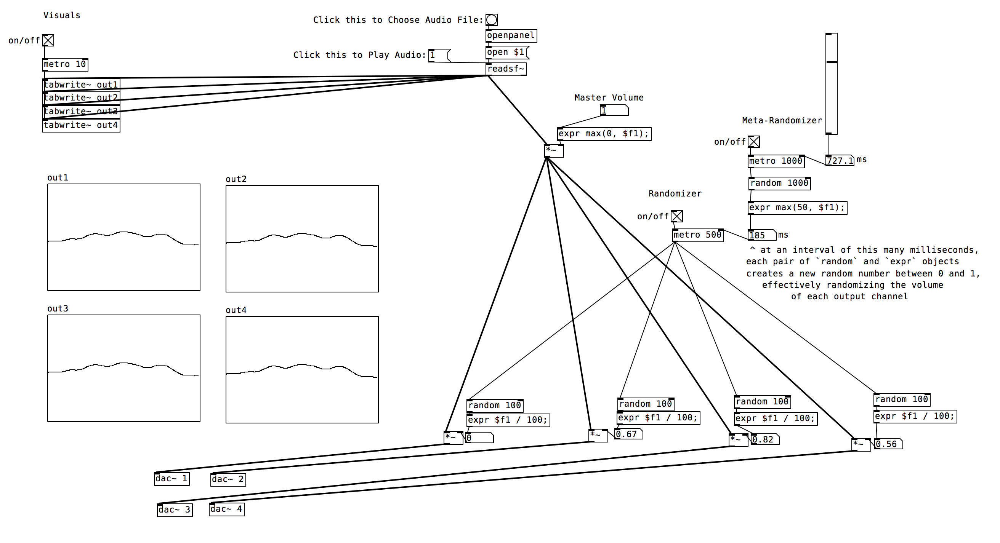

# PureData-Patches

This repository contains patches for [Pure Data (Pd)](https://puredata.info), an "open source visual programming language for multimedia".

The `QuadraphonicRandomizer.pd` patch looks like this:

